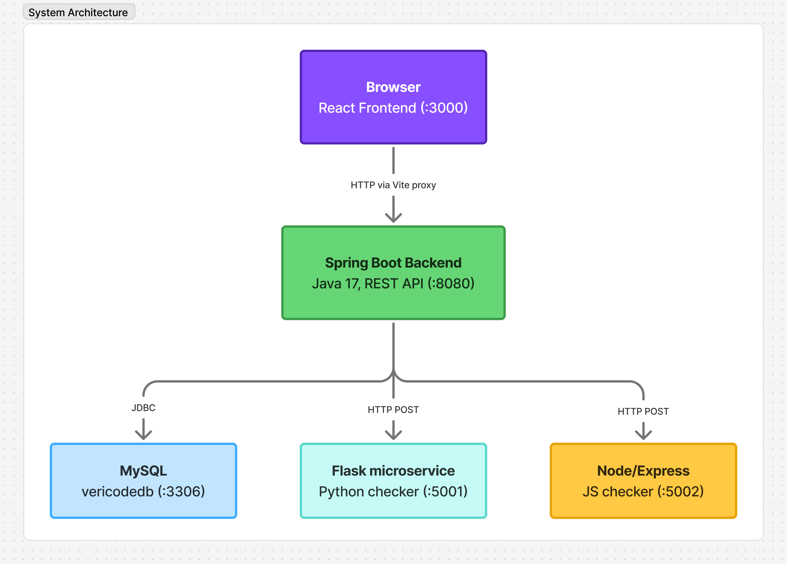

# Vericode - Design Document (Milestone 2)

**Course:** CSYE 6300 - Software Design Patterns, Spring 2026
**Group:** 3
**Project:** Vericode - A Code Review Platform
**Repository:** *(link to private GitHub repository)*
**Team Members:** Arundhati Bandopadhyaya, Keya Goswami, Shreya Wanisha, Maitri Pasale

---

## Table of Contents

1. [Design Patterns Used](#1-design-patterns-used)
2. [System Architecture](#2-system-architecture)
3. [Component and Service Breakdown](#3-component-and-service-breakdown)
4. [Technology Stack](#4-technology-stack)

---

## 1. Design Patterns Used

Vericode uses seventeen Gang of Four design patterns. Each pattern was chosen to solve a concrete problem in the codebase, not applied for its own sake.

---

### Creational Patterns

**Builder**
Problem: A PullRequest object requires a title, author, description, language, code content, and initial status. Passing all of these through a single constructor leads to ambiguous long-parameter lists and makes partial construction error-prone.
Solution: `PullRequestBuilder` constructs a PullRequest object incrementally, one field at a time. The backend controller calls the builder rather than invoking a constructor directly, making the construction readable and safe.

**Factory**
Problem: The system supports three languages (Java, Python, JavaScript). Deciding which checker to instantiate based on a runtime language value would require conditionals scattered across the codebase.
Solution: `CheckerFactory` centralizes that decision. Given a `Language` enum value, it returns the correct `CodeChecker` instance. The rest of the system never sees the selection logic.

**Prototype**
Problem: Every new PR needs a review checklist that is specific to its language. Building a fresh checklist object from scratch on every submission is wasteful, and the template objects themselves are not trivial to construct.
Solution: `ReviewTemplateRegistry` maintains a pre-built prototype checklist for each language. When a PR is submitted, the registry clones the appropriate prototype rather than constructing a new one. Reviewers get a consistent starting checklist on every PR.

**Singleton**
Problem: `ReviewSessionManager` holds shared review state that must be consistent across all requests. Multiple instances would create conflicting state.
Solution: `ReviewSessionManager` is a Spring-managed singleton bean. Spring guarantees one instance per application context, ensuring all components share the same session state.

---

### Structural Patterns

**Adapter**
Problem: Checkstyle is a third-party library with its own API. The rest of the check pipeline expects a `CodeChecker` interface. Coupling the pipeline directly to Checkstyle's API would make the library hard to replace and impossible to mock in tests.
Solution: `CheckstyleAdapter` wraps the Checkstyle library and translates its output into the `CheckResult`/`Violation` model used by the rest of the system. The pipeline never sees Checkstyle's native types.

**Bridge**
Problem: Notifications need to be delivered through multiple channels (email, in-app, WebSocket). Without Bridge, adding a new notification type (e.g., a merge notification) would require duplicating it for every channel, and adding a new channel would require duplicating it for every notification type.
Solution: The abstraction side (`StatusChangeNotification`) owns the logic for building the notification message. The implementor side (`NotificationChannel` and its concrete implementations) owns delivery. A notification object receives a channel at construction time and delegates the send to it. The two hierarchies grow independently.

**Composite**
Problem: A `Review` contains multiple `Comment` objects. Code that processes a review should be able to treat the whole and the parts uniformly.
Solution: `Review` acts as the composite node containing a collection of `Comment` leaf objects. Consumers iterate comments through the parent review without needing to know how many exist or manage the collection directly.

**Decorator**
Problem: Code analysis needs to run through three independent layers: lint checking, style checking, and security checking. These concerns should be composable and individually switchable, not hardcoded in one class.
Solution: `LintDecorator`, `StyleDecorator`, and `SecurityDecorator` each wrap a `CodeChecker` and add one layer of analysis. They are stacked at runtime, so the full pipeline is `SecurityDecorator(StyleDecorator(LintDecorator(baseChecker)))`. Any layer can be dropped or reordered without touching the others.

**Facade**
Problem: Submitting a PR involves the Builder, CheckerFactory, Decorator chain, Prototype registry, Command system, and NotificationService. Having the controller call all of these directly would couple it to every subsystem.
Solution: `ReviewFacade` is a single entry point. The controller calls one method on the Facade; the Facade coordinates all subsystems internally. Controllers are reduced to handling HTTP concerns only.

**Flyweight**
Problem: Lint and style rules are constant objects. Creating a new rule object for every violation check across hundreds of PR submissions wastes memory.
Solution: `CheckRulePool` is a shared pool of rule objects. All checkers retrieve rules from the pool rather than constructing new instances. The same rule object is reused across all PRs for the lifetime of the application.

---

### Behavioral Patterns

**Command**
Problem: Review actions (approve, reject, request changes, comment) need to be logged for audit purposes and reversible via an undo operation. Implementing undo as ad-hoc rollback logic scattered across service methods is fragile.
Solution: Each action is encapsulated in a Command object (`ApproveCommand`, `RejectCommand`, `CommentCommand`). Commands are executed and pushed onto a `CommandHistory` stack. Undoing an action pops the stack and calls the command's undo method.

**Observer**
Problem: Multiple delivery mechanisms (email, in-app notifications, WebSocket push) must all react when a PR's status changes. Hardcoding the list of notification calls inside the state transition logic creates tight coupling and makes it difficult to add or remove delivery methods.
Solution: `PRStatusObserver` is an interface with a single `onStatusChange(PullRequest)` method. `InAppNotifier`, `EmailNotifier`, and `WebSocketNotifier` implement it and are registered as Spring components. `NotificationService` holds a `List<PRStatusObserver>` that Spring populates automatically at startup. When a status changes, `NotificationService.notifyAll()` fans the event to every observer without knowing anything about delivery specifics. Adding a new notifier requires creating one class; no other code changes.

**State**
Problem: A PullRequest moves through a defined lifecycle: Draft -> In Review -> Changes Requested -> Approved -> Merged. Without the State pattern, the transitions would be implemented as large conditionals checking the current status on every operation, and invalid transitions (e.g., merging a draft) would have to be guarded manually everywhere.
Solution: Each lifecycle stage is a separate state class (`DraftState`, `InReviewState`, `ChangesRequestedState`, `ApprovedState`, `MergedState`). The `PullRequest` entity delegates lifecycle operations to its current state object. Each state only implements the transitions that are legal from that stage and throws an error for the rest. The PR object replaces its state reference as transitions occur.

**Strategy**
Problem: Java, Python, and JavaScript require different analysis tools with different execution models. Embedding all three in a single class would make the checker hard to maintain and impossible to test independently.
Solution: `JavaCheckStrategy`, `PythonCheckStrategy`, and `JSCheckStrategy` each implement `CheckStrategy`. Java analysis runs Checkstyle in-process. Python and JavaScript analysis call their respective microservices over HTTP. The Decorator pipeline works against the `CheckStrategy` interface and does not know which language it is analyzing.

**Template Method**
Problem: Code review workflows share a fixed skeleton: receive submission, analyze code, apply reviewer checklist, record outcome. But each language or review type may need to customize individual steps.
Solution: `CodeReviewTemplate` defines the fixed algorithm structure as a sequence of method calls. Subclasses override only the steps that differ. The overall sequence is controlled by the parent class and cannot be reordered by subclasses.

---

## 2. System Architecture

Vericode is composed of four runtime components: a React frontend, a Spring Boot backend, two language-checker microservices, and a MySQL database. All inter-component communication is over HTTP.

---

### Components

**Frontend (React 18 / Vite, port 3000)**
A single-page application responsible for all user interaction. It communicates with the backend exclusively through an Axios HTTP client. Vite's development proxy forwards all `/api/*` requests to `localhost:8080`, so the browser makes no direct connection to the backend or microservices. User session state is stored in `localStorage` and surfaced to components through a React Context. There is no global state library.

**Backend (Spring Boot 3.2.4 / Java 17, port 8080)**
The core application server. It exposes three REST controller groups:
- `/api/users` - registration, login with BCrypt password hashing, and profile management
- `/api/pullrequests` - create, read, update, and delete pull requests
- `/api/reviews` - the full review lifecycle: submit for review, approve, reject, request changes, comment, merge, and undo

All business logic lives in the backend. It is the only component that connects to the database. CORS is configured to allow requests from `http://localhost:3000` only.

**Python Checker Microservice (Flask 3.1.0, port 5001)**
A standalone HTTP service. It accepts a POST request containing a code string, writes the code to a temporary file, runs Pylint against it, parses the output into a structured violations list, and returns it as JSON. The backend calls this service when a Python PR is submitted.

**JavaScript Checker Microservice (Node.js / Express 4.21.0, port 5002)**
Identical contract to the Python service. It runs ESLint on the submitted JavaScript code and returns structured violations. The backend calls this service when a JavaScript PR is submitted.

**Database (MySQL, port 3306, schema: `vericodedb`)**
Stores all persistent data: users, pull requests, reviews, comments, and review templates. Hibernate manages schema creation and updates automatically. Only the backend holds a database connection.

---

### How the Components Interact

The frontend never communicates with the microservices or the database directly. The microservices have no database connection and no knowledge of each other.

---

### Data Flow: PR Submission

1. The user fills in the PR form in the browser and submits it.
2. The frontend sends `POST /api/pullrequests` to the backend with the title, code, language, and author details.
3. The backend's `ReviewFacade` receives the request. It uses `PullRequestBuilder` to construct the PR entity.
4. `CheckerFactory` selects the correct `CheckStrategy` based on the PR's language. For Java, Checkstyle runs in-process. For Python or JavaScript, the backend makes an outbound `POST /check` request to the appropriate microservice, which returns violations.
5. The Decorator chain (`LintDecorator` -> `StyleDecorator` -> `SecurityDecorator`) processes the violations and produces a `CheckResult`.
6. `ReviewTemplateRegistry` clones a checklist prototype for the PR's language.
7. The PR entity and check results are persisted to MySQL via JPA.
8. The response - PR data, check results, and review checklist - is returned to the frontend as JSON.
9. The frontend renders the PR card with the violations panel and review checklist.

---

### Data Flow: Review Action

1. A reviewer clicks an action (e.g., Approve) in the PR detail view.
2. The frontend sends `POST /api/reviews/{id}/approve`.
3. The `ReviewFacade` wraps the action in an `ApproveCommand` object.
4. The command executes: the PR's current `State` object validates the transition and updates the PR's status from `IN_REVIEW` to `APPROVED`.
5. The command is pushed onto the `CommandHistory` stack.
6. The updated PR is persisted to the database.
7. `NotificationService.notifyAll()` is called. Each registered observer (`InAppNotifier`, `EmailNotifier`, `WebSocketNotifier`) calls `onStatusChange()`. Each observer constructs its message and delegates delivery to a `NotificationChannel` implementation (Bridge pattern).
8. The updated PR state is returned to the frontend.

---

### What Is Not Yet Wired

- All four processes are started manually - there is no Docker or container orchestration.
- Authentication is session-less: the client passes user identity in request payloads. Per-request server-side verification via JWT or Spring Security is not yet implemented.
- There is no caching layer (no Redis, no Spring Cache annotations).
- Observer notifications are synchronous and in-process. Notification channel delivery (email, WebSocket push) is currently simulated; the channel implementations are stubs.

---

## 3. Component and Service Breakdown

### Backend

---

**PR Controller** (`/api/pullrequests`)
Purpose: Handles HTTP requests for creating, retrieving, updating, and deleting pull requests. Translates HTTP concerns into service calls and returns JSON responses.
Patterns: Delegates construction to `PullRequestBuilder` (Builder). Routes check logic through `CheckerFactory` (Factory) and the Decorator chain.

---

**Review Controller** (`/api/reviews`)
Purpose: Handles the review lifecycle endpoints - submit, approve, reject, request changes, comment, merge, and undo. Also exposes the command history endpoint.
Patterns: Every action is wrapped in a Command object (Command). State transitions are validated by the PR's current State object (State). Delegates to `ReviewFacade` (Facade) to coordinate subsystems.

---

**User Controller** (`/api/users`)
Purpose: Handles user registration, login, and profile updates. Hashes passwords with BCrypt on registration and verifies the hash on login.
Patterns: Standard Spring MVC controller; no Gang of Four pattern is the primary driver here. Participates in the overall layered architecture.

---

**Review Facade** (`ReviewFacade`)
Purpose: Single entry point coordinating all backend subsystems for a review action. Keeps controllers free of orchestration logic.
Patterns: Facade. Coordinates Builder, Factory, Decorator, Prototype, Command, State, and NotificationService in the correct sequence.

---

**Check Pipeline** (`checker` package)
Purpose: Analyzes submitted code through three independent layers - lint, style, and security - and returns a structured list of violations.
Components:
- `CheckerFactory` selects the strategy based on language (Factory).
- `JavaCheckStrategy`, `PythonCheckStrategy`, `JSCheckStrategy` each implement the analysis for one language (Strategy). Python and JavaScript strategies call their microservices over HTTP.
- `CheckstyleAdapter` wraps the Checkstyle library to fit the `CodeChecker` interface (Adapter).
- `LintDecorator`, `StyleDecorator`, `SecurityDecorator` wrap the base checker and add analysis layers (Decorator).
- `CheckRulePool` provides shared rule objects reused across all checks (Flyweight).

---

**Notification System** (`notification` and `observer` packages)
Purpose: Delivers status-change notifications to users through multiple channels whenever a PR's status changes.
Components:
- `NotificationService` holds all registered observers and fans out status-change events (Observer subject).
- `InAppNotifier`, `EmailNotifier`, `WebSocketNotifier` each react to status changes independently (Observer concrete observers).
- `StatusChangeNotification` builds the notification message and delegates delivery to a channel (Bridge abstraction).
- `EmailChannel`, `InAppChannel`, `WebSocketChannel` each implement the physical delivery mechanism (Bridge concrete implementors).

The Observer and Bridge patterns are complementary here. Observer determines who gets notified; Bridge determines how each notification is delivered.

---

**Command History** (`service` package)
Purpose: Records every review action as a Command object and supports undoing the most recent action.
Components:
- `ApproveCommand`, `RejectCommand`, `CommentCommand` encapsulate a single action with execute and undo operations (Command).
- `CommandHistory` maintains the stack of executed commands.

---

**PR State Machine** (`model` package)
Purpose: Enforces valid PR lifecycle transitions and rejects illegal ones (e.g., merging a draft).
Components:
- `DraftState`, `InReviewState`, `ChangesRequestedState`, `ApprovedState`, `MergedState` each implement only the transitions that are legal from that stage (State).
- `PullRequest` delegates lifecycle method calls to its current state object and swaps the state reference on transition.

---

**Review Template Registry** (`service` package)
Purpose: Provides a pre-built review checklist for each language on every PR submission without constructing a new object from scratch each time.
Patterns: Prototype. The registry stores one prototype per language and returns a deep clone on each request.

---

**Review Session Manager** (`service` package)
Purpose: Maintains shared review session state consistently across all requests within a single application instance.
Patterns: Singleton. Spring manages one instance per application context.

---

**Code Review Template** (`service` package)
Purpose: Defines the fixed algorithm for the review workflow - receive, analyze, apply checklist, record outcome - while allowing individual steps to be customized per language or review type.
Patterns: Template Method.

---

### Microservices

**Python Checker** (`python-checker/`, Flask, port 5001)
Purpose: Isolates Python code analysis using Pylint. Runs as an independent process so that Python runtime dependencies are kept out of the JVM backend. Accepts raw code over HTTP and returns structured violations.

**JavaScript Checker** (`js-checker/`, Node.js / Express, port 5002)
Purpose: Isolates JavaScript code analysis using ESLint. Same separation-of-concerns rationale as the Python service. Accepts raw code over HTTP and returns structured violations with severity levels.

---

### Frontend

**Services layer** (`services/`)
Purpose: Centralizes all HTTP calls to the backend. `api.js` defines an Axios instance with the base URL; `prService.js` and `userService.js` wrap each endpoint in a named function. Components never construct HTTP requests directly.

**Context layer** (`context/`)
Purpose: `UserContext` provides the logged-in user object and login/logout functions to the entire component tree without prop drilling. `NotificationContext` is scaffolded for future in-app notification delivery.

**Pages and Components** (`pages/`, `components/`)
Purpose: `PRListPage`, `PRDetailPage`, and `PRSubmitPage` are the three core views. Components such as `CheckResults`, `ReviewActions`, and `CommentThread` are reusable pieces composed into those pages. `ProtectedRoute` guards all pages that require authentication.

---

## 4. Technology Stack

### Backend

| Technology | Version | Role |
|---|---|---|
| Java | 17 | Primary backend language |
| Spring Boot | 3.2.4 | Application framework, dependency injection, REST |
| Spring Web (MVC) | (via Spring Boot) | REST controllers, request mapping |
| Spring Data JPA | (via Spring Boot) | ORM, repository abstraction |
| Hibernate | (via Spring Boot) | JPA implementation, schema management |
| MySQL | 8.x | Persistent relational database |
| BCrypt (Spring Security Crypto) | (via Spring Boot) | Password hashing |
| Checkstyle | 10.x | In-process Java static analysis |
| Maven | 3.x | Build tool, dependency management |
| Lombok | (via pom.xml) | Boilerplate reduction (getters, constructors) |

### Frontend

| Technology | Version | Role |
|---|---|---|
| React | 18 | UI component library |
| Vite | 5.x | Build tool and dev server |
| React Router | 6 | Client-side routing |
| Axios | 1.x | HTTP client |
| HTML5 / CSS3 | - | Markup and styling |
| ESLint | 8.x | Frontend code linting |

### Python Microservice

| Technology | Version | Role |
|---|---|---|
| Python | 3.x | Microservice language |
| Flask | 3.1.0 | HTTP server framework |
| Pylint | 3.3.6 | Python static analysis tool |

### JavaScript Microservice

| Technology | Version | Role |
|---|---|---|
| Node.js | 18.x | Microservice runtime |
| Express | 4.21.0 | HTTP server framework |
| ESLint | 8.57.0 | JavaScript static analysis tool |

### Infrastructure and Tooling

| Technology | Role |
|---|---|
| Git / GitHub | Version control, collaboration |
| MySQL | Relational database for persistent data storage |

---

*CSYE 6300 - Software Design Patterns - Spring 2026 - Group 3*
