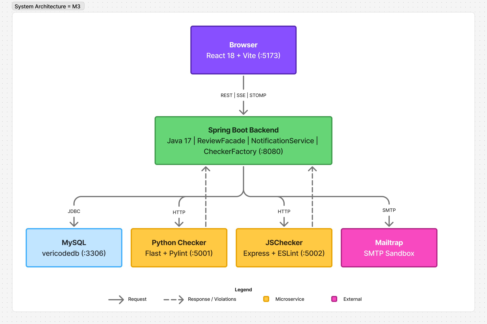
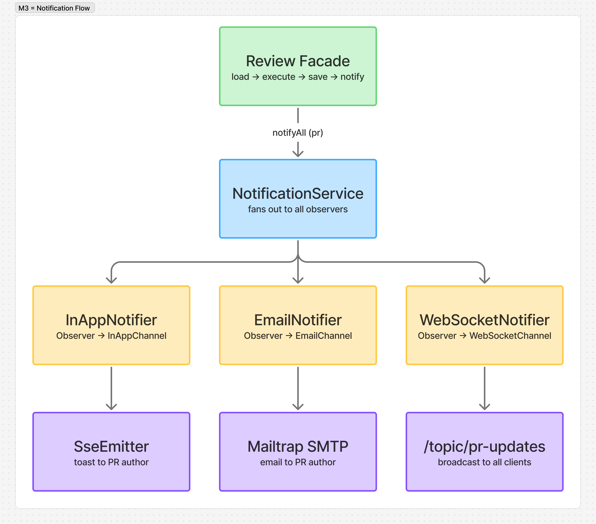

# Vericode - Design Document (Milestone 3)

---

## 1. Design Patterns Used

Vericode implements seventeen Gang of Four design patterns. Each pattern was chosen to solve a specific structural or behavioral problem in the system.

---

### Observer
**Problem solved:** When a pull request changes status, multiple independent systems (email, in-app toast, WebSocket broadcast) need to react. Hardcoding these reactions into the review logic would tightly couple unrelated concerns and make adding new channels invasive.

**How it is applied:** `PRStatusObserver` is a Java interface that declares a single `onStatusChange(PullRequest)` method. Three concrete observers -- `EmailNotifier`, `InAppNotifier`, and `WebSocketNotifier` -- each implement this interface as Spring-managed components. `NotificationService` holds an auto-wired list of all registered observers and fans out each status change to all of them. Adding a new notification channel requires only creating a new `@Component` that implements the interface; nothing else changes.

---

### Bridge
**Problem solved:** The Observer layer knows _what_ happened (a PR was approved, merged, etc.) but should not know _how_ to deliver that information. Email delivery, SSE streaming, and STOMP broadcasting are three entirely different mechanisms that need to evolve independently of the notification types.

**How it is applied:** `NotificationChannel` is a Java interface declaring `send(recipient, subject, message)`. Three concrete implementors -- `EmailChannel`, `InAppChannel`, and `WebSocketChannel` -- each encapsulate one delivery mechanism. Each Observer delegates to its corresponding Channel. This Bridge separates the "what to say" (Observer) from "how to say it" (Channel), so either hierarchy can change without affecting the other.

---

### Facade
**Problem solved:** HTTP controllers should not coordinate repositories, command execution, history management, and notification broadcasting. Exposing this logic directly to controllers would scatter business rules across the HTTP layer.

**How it is applied:** `ReviewFacade` provides a single entry point for all review operations: `submit`, `approve`, `requestChanges`, `merge`, `comment`, and `undo`. Internally it loads the pull request, executes the appropriate Command, saves the result, and triggers notifications -- in that order, every time. Controllers call one method on the Facade and are completely shielded from the coordination logic underneath.

---

### Command
**Problem solved:** Review actions (approve, reject, comment) need to be undoable and auditable. Without encapsulation, reverting an action would require custom rollback logic spread across multiple services.

**How it is applied:** `ReviewCommand` is an interface with `execute()`, `undo()`, and `getDescription()` methods. `ApproveCommand`, `RejectCommand`, and `CommentCommand` each capture the previous state before applying their change. `CommandHistory` maintains a `Deque` of executed commands. Calling `undo()` on the Facade pops the most recent command from the stack and reverts it. The pattern provides a clean audit trail and one-step undo without special-casing.

---

### State
**Problem solved:** A pull request moves through a strict lifecycle (Draft -> In Review -> Approved or Changes Requested -> Merged). Enforcing valid transitions with if-else chains in the PR model becomes error-prone as states multiply.

**How it is applied:** `PRState` is an interface with methods for each lifecycle event (`submit`, `approve`, `requestChanges`, `merge`). Five concrete state classes -- `DraftState`, `InReviewState`, `ChangesRequestedState`, `ApprovedState`, `MergedState` -- each implement only the transitions legal from that state and throw exceptions for invalid ones (e.g., merging a Draft). The `PullRequest` entity holds a current state reference and delegates all lifecycle calls to it.

---

### Factory
**Problem solved:** Callers that need a code checker should not need to know which strategy, adapters, decorators, or proxies to assemble for a given language.

**How it is applied:** `CheckerFactory` exposes a single `createChecker(Language)` method. Internally it selects the right strategy, wraps it in the `StrategyCheckerAdapter`, stacks the three decorator layers (Lint, Style, Security) on top, and finally wraps the entire pipeline in a `CachingCheckerProxy`. Callers receive a fully configured `CodeChecker` without ever referencing concrete implementation classes.

---

### Strategy
**Problem solved:** Java, Python, and JavaScript code analysis require completely different backends (Checkstyle library, Pylint microservice, ESLint microservice). Switching between them based on language should not require conditional branching at the call site.

**How it is applied:** `CheckStrategy` defines an `execute(code)` method. `JavaCheckStrategy` delegates to `CheckstyleAdapter` for in-process analysis. `PythonCheckStrategy` and `JSCheckStrategy` both extend `RemoteCheckTemplate` (Template Method) and provide only their service URL and name -- the HTTP call logic is inherited. All strategies return standardized `CheckResult` objects. `CheckerFactory` selects the correct strategy; callers never see the difference.

---

### Decorator
**Problem solved:** Code analysis involves multiple independent layers (lint checks, style checks, security checks). Hardcoding all layers into a single class makes the logic monolithic and prevents selective composition.

**How it is applied:** `CheckerDecorator` is an abstract class that wraps a `CodeChecker` and delegates to it. `LintDecorator`, `StyleDecorator`, and `SecurityDecorator` each add their layer of checks on top of the wrapped instance. `CheckerFactory` assembles them in order: `LintDecorator(StyleDecorator(SecurityDecorator(StrategyCheckerAdapter)))`. Each decorator calls the wrapped layer first, then appends its own violations to the result.

---

### Adapter
**Problem solved:** The Checkstyle library has its own API (audit listeners, configuration loading, file I/O) that does not match the `CodeChecker` interface the rest of the system expects. Similarly, `CheckStrategy` and `CodeChecker` are separate interfaces that need to be bridged.

**How it is applied:** `CheckstyleAdapter` wraps the Checkstyle library. It writes submitted code to a temporary file, runs Checkstyle with a configuration, collects violations via a `ViolationCollector` (an `AuditListener`), maps Checkstyle severity levels to the system's standard levels, and cleans up. `StrategyCheckerAdapter` is a simpler adapter that maps `CheckStrategy.execute()` to `CodeChecker.check()`.

---

### Composite
**Problem solved:** A code review consists of individual line-level comments. The system needs to display and traverse both individual comments and entire reviews uniformly.

**How it is applied:** `ReviewComponent` is an interface with a `display()` method. `Comment` is a leaf node holding a single piece of feedback. `Review` is a composite that holds a `List<ReviewComponent>` and iterates it when `display()` is called. Both are treated uniformly by any code that consumes `ReviewComponent`.

---

### Builder
**Problem solved:** Creating a `PullRequest` object requires several fields and validation. Allowing direct construction risks creating incomplete objects with no title, author, or code snippet.

**How it is applied:** `PullRequestBuilder` provides a fluent API: `title()`, `author()`, `language()`, `codeSnippet()`, `description()`. The `build()` method validates that all required fields are present and throws `IllegalStateException` for any missing ones, then returns a fully initialized `PullRequest`.

---

### Flyweight
**Problem solved:** Rule definitions (message text, severity, category) are referenced by every code check. Storing a separate rule object per check wastes memory and creates inconsistency when rule text needs to change.

**How it is applied:** `CheckRulePool` holds a static map of all rule definitions, initialized once at startup (twelve rules across Security, Style, and Lint categories). Decorators fetch rules by category and name via `getRule()` rather than hardcoding strings. All pull request checks share the same rule objects; there is no per-check duplication.

---

### Prototype
**Problem solved:** Pre-built review checklists (Standard, Security, Quick) need to be assigned to each PR independently. Sharing references to template objects would cause modifications on one PR's checklist to corrupt others.

**How it is applied:** `ReviewTemplate` implements `Cloneable` and overrides `clone()` with a deep copy that also clones the inner `checklistItems` list. `ReviewTemplateRegistry` stores three canonical templates and returns a fresh clone on every `getTemplate(type)` call. Each PR works with its own copy.

---

### Singleton
**Problem solved:** A global map of which reviewer is currently assigned to which PR must be consistent across all threads. Multiple instances of this manager would produce conflicting session data.

**How it is applied:** `ReviewSessionManager` has a private constructor and a static `getInstance()` method. It uses a `ConcurrentHashMap<Long, String>` (PR ID -> reviewer ID) to guarantee thread-safe access. All services that check or update session state call through the same instance.

---

### Chain of Responsibility
**Problem solved:** Pull request submissions must pass multiple independent validations (title length, non-empty code, existing author, valid language). Hardcoding all checks in the controller mixes concerns and makes it difficult to add or reorder validators.

**How it is applied:** `PRValidationHandler` is an abstract class that holds a reference to the next handler. Four concrete handlers -- `TitleValidationHandler`, `CodeSnippetValidationHandler`, `AuthorValidationHandler`, `LanguageValidationHandler` -- each validate one concern and delegate to the next if they pass. The chain is assembled in `PRController` before any processing begins. The first failure short-circuits the chain and returns an error to the caller.

---

### Template Method
**Problem solved:** Python and JavaScript code analysis both follow the same HTTP-based algorithm: validate the input, build a JSON request, call an external microservice, and parse the violation response. Before Template Method, this entire algorithm was duplicated line-for-line in `PythonCheckStrategy` and `JSCheckStrategy`. Any change to the HTTP flow (e.g., adding a timeout header, changing error handling) had to be made in two places.

**How it is applied:** `RemoteCheckTemplate` is an abstract class that implements `CheckStrategy`. Its `execute()` method is declared `final` and defines the fixed skeleton: `validateInput` -> `callService` -> `parseViolations`. Each step is a `protected` method with a default implementation. Subclasses -- `PythonCheckStrategy` and `JSCheckStrategy` -- override only two abstract methods: `getServiceUrl()` and `getServiceName()`. The skeleton cannot be reordered or skipped by subclasses. `JavaCheckStrategy` does not extend this template because it runs Checkstyle in-process rather than over HTTP, so it remains a standalone `CheckStrategy` implementation.

---

### Proxy
**Problem solved:** Every time a PR is submitted or re-checked, the full decorator pipeline runs from scratch -- including potentially expensive HTTP calls to the Python or JavaScript microservices. If the same code snippet is submitted twice (e.g., a page reload, or a user resubmitting without changes), the system wastes time re-running identical analysis.

**How it is applied:** `CachingCheckerProxy` implements the `CodeChecker` interface and wraps the fully decorated checker returned by `CheckerFactory`. It maintains a `ConcurrentHashMap` keyed by the hash of the code string. On the first call for a given snippet, the proxy delegates to the real checker and caches the result. On subsequent calls with the same code, the cached result is returned immediately. Because the proxy implements `CodeChecker`, callers (like `PRController`) are completely unaware that caching is in play. The proxy is assembled inside `CheckerFactory.createChecker()` as the outermost wrapper.

---

## 2. System Architecture

Vericode is a multi-tier web application organized into five major runtime components: a React frontend, a Spring Boot backend, a MySQL database, a Python microservice, and a Node.js microservice. All external communication passes through the backend; the frontend never contacts the microservices directly.

---

### Frontend (React 18 + Vite, port 5173)

The frontend is a single-page application that communicates with the backend through three channels:

- **REST over HTTP** (via Axios): used for all CRUD operations -- submitting pull requests, loading PR lists and details, performing review actions.
- **Server-Sent Events (SSE)**: used for targeted, per-user in-app notifications. On login, the frontend opens a persistent `EventSource` connection to `/api/notifications/stream?username={username}`. When the backend pushes an event over this connection, the `NotificationContext` adds it to a toast queue and `NotificationBanner` displays it.
- **STOMP over WebSocket** (via SockJS + STOMP.js): used for real-time broadcast updates. The frontend subscribes to `/topic/pr-updates`. When any PR changes status, all connected browser tabs receive the update without polling.

Key components:
- `NotificationContext` manages both the SSE and STOMP connections for the lifetime of the session.
- `PRList` and `PRCard` display the live pull request feed, refreshed via WebSocket events.
- `PRDetailPage` shows full PR details: code snippet, check results, comment thread, and action buttons.
- `ReviewActions` sends approve / reject / merge / comment / undo requests to the backend REST API.
- `PRSubmitPage` and `PRForm` handle new PR creation with language selection.
- `ProtectedRoute` enforces authentication before rendering any page.

---

### Backend (Spring Boot 3.2.4, Java 17, port 8080)

The backend is a layered Spring Boot application. The layers, from outermost to innermost, are:

**Controllers (HTTP layer):** Receive HTTP requests, validate input, delegate to services, and return responses. They contain no business logic. Key controllers:
- `PRController`: accepts new PR submissions, runs the validation chain, calls the checker factory, applies a review template, and persists the result.
- `ReviewController`: receives review actions (approve, reject, merge, comment, undo) and delegates each to `ReviewFacade`.
- `SseController`: handles SSE stream registration for in-app notifications.
- `UserController`: handles registration and lookup.

**Services and Facades (business logic layer):** All domain logic lives here.
- `ReviewFacade` coordinates the complete review workflow.
- `NotificationService` fans out status changes to all registered observers.
- `CommandHistory` manages the undo stack.
- `ReviewSessionManager` tracks active reviewer assignments.
- `ReviewTemplateRegistry` supplies cloned review checklists.
- `CheckerFactory` constructs fully decorated language-specific checkers.

**Repositories (data access layer):** Spring Data JPA repositories (`PullRequestRepository`, `UserRepository`) translate domain objects to and from SQL using Hibernate.

**Configuration:**
- `WebSocketConfig` registers the STOMP message broker on `/ws` and enables the `/topic` destination prefix.
- `WebConfig` configures CORS to allow requests from the frontend origin.
- `DataSeeder` pre-populates test users on startup.

---

### Database (MySQL, port 3306)

MySQL stores two primary entities: `users` and `pull_requests`. The schema is managed by Hibernate's `ddl-auto=update` setting, which applies schema changes automatically on startup. The `pull_requests` table references `users` via a foreign key on the author field. No caching layer is used; all reads go directly to the database.

---

### Python Microservice (Flask + Pylint, port 5001)

This microservice handles static analysis of Python code. It exposes a single `POST /check` endpoint. The backend's `PythonCheckStrategy` sends the code snippet in a JSON request body. The microservice writes the code to a temporary file, runs Pylint with JSON output format, maps Pylint's message type codes to the system's standard Lint/Style severity model, and returns a list of violations. The temp file is deleted after analysis.

---

### JavaScript Microservice (Node.js + Express + ESLint, port 5002)

This microservice handles static analysis of JavaScript code. It exposes a single `POST /check` endpoint. The backend's `JSCheckStrategy` sends the code snippet as JSON. The microservice writes the code to a temporary file, runs ESLint programmatically, maps ESLint rule IDs to Security/Style/Lint categories and severity levels, and returns the violations list. The temp file is deleted after analysis.

---

### Data Flow

**Submitting a new PR:**
Browser -> `POST /api/pullrequests` -> `PRController` -> validation chain -> `CheckerFactory` (selects strategy) -> language microservice (Python 5001 or JS 5002 via HTTP, or Checkstyle library for Java) -> `CheckResult` stored on entity -> `PullRequestRepository.save()` -> response to browser.

**Performing a review action (e.g., approve):**
Browser -> `POST /api/reviews/{id}/approve` -> `ReviewController` -> `ReviewFacade.approve()` -> load PR from repository -> execute `ApproveCommand` (state transition) -> save PR -> `NotificationService.notifyAll()` -> three observers in parallel:
- `EmailNotifier` -> `EmailChannel` -> JavaMailSender -> Mailtrap SMTP -> email delivered
- `InAppNotifier` -> `InAppChannel` -> `SseEmitterRegistry` -> open SSE connection -> browser toast notification
- `WebSocketNotifier` -> `WebSocketChannel` -> `SimpMessagingTemplate` -> `/topic/pr-updates` -> all connected browser tabs update in real time.

---

## 3. Component / Service Breakdown

| Component | Purpose | Design Pattern(s) |
|---|---|---|
| `ReviewFacade` | Single entry point for all review operations; enforces load -> execute -> save -> notify ordering | Facade |
| `NotificationService` | Fans out PR status changes to all registered observer instances | Observer |
| `EmailNotifier` | Reacts to status changes and requests email delivery for actionable events | Observer |
| `InAppNotifier` | Reacts to status changes and requests SSE delivery to the PR author | Observer |
| `WebSocketNotifier` | Reacts to status changes and requests STOMP broadcast to all connected clients | Observer |
| `EmailChannel` | Delivers notification messages via JavaMailSender and Mailtrap SMTP | Bridge (implementor) |
| `InAppChannel` | Delivers notification messages via SSE to a named user's open browser connection | Bridge (implementor) |
| `WebSocketChannel` | Delivers notification messages via STOMP broadcast to `/topic/pr-updates` | Bridge (implementor) |
| `SseEmitterRegistry` | Maintains a live map of username -> SSE emitter; registers new connections and removes expired ones | (infrastructure) |
| `CommandHistory` | Manages an ordered stack of executed review commands; supports single-step undo | Command |
| `ApproveCommand` | Encapsulates the approve action with its previous state; executable and undoable | Command |
| `RejectCommand` | Encapsulates the request-changes action with its previous state; executable and undoable | Command |
| `CommentCommand` | Encapsulates adding a comment; undo removes the last added comment | Command |
| `DraftState`, `InReviewState`, `ChangesRequestedState`, `ApprovedState`, `MergedState` | Each state enforces which lifecycle transitions are valid and which are forbidden | State |
| `CheckerFactory` | Creates a fully assembled, language-specific checker wrapped in a caching proxy; hides all implementation details from callers | Factory, Proxy |
| `RemoteCheckTemplate` | Abstract class defining the fixed HTTP check skeleton (validate -> call service -> parse); subclasses provide only URL and service name | Template Method |
| `PythonCheckStrategy`, `JSCheckStrategy` | Concrete subclasses of `RemoteCheckTemplate`; each provides the microservice URL and name | Template Method, Strategy |
| `JavaCheckStrategy` | Standalone strategy for in-process Checkstyle analysis (does not use the remote template) | Strategy |
| `CachingCheckerProxy` | Wraps a `CodeChecker` and caches results by code hash; avoids redundant microservice calls on identical submissions | Proxy |
| `CheckstyleAdapter` | Wraps the Checkstyle library API to match the `CodeChecker` interface | Adapter |
| `StrategyCheckerAdapter` | Adapts `CheckStrategy` to `CodeChecker` so strategies can be used in the decorator chain | Adapter |
| `LintDecorator`, `StyleDecorator`, `SecurityDecorator` | Each adds one layer of analysis on top of the wrapped checker without modifying it | Decorator |
| `CheckerDecorator` | Abstract base that delegates to the wrapped checker; concrete decorators extend this | Decorator |
| `CheckRulePool` | Shared static pool of all rule definitions; avoids per-check duplication | Flyweight |
| `ReviewTemplate` / `ReviewTemplateRegistry` | Stores canonical review checklists and returns deep clones so each PR has an independent copy | Prototype |
| `ReviewSessionManager` | Global singleton tracking which reviewer is active on which PR; thread-safe | Singleton |
| `PullRequestBuilder` | Fluent builder for `PullRequest` with mandatory-field validation at build time | Builder |
| `Review` | Composite node holding a collection of `ReviewComponent` children | Composite |
| `Comment` | Leaf node in the review composite hierarchy; represents one line-level piece of feedback | Composite |
| `TitleValidationHandler`, `CodeSnippetValidationHandler`, `AuthorValidationHandler`, `LanguageValidationHandler` | Validation pipeline assembled at request time; each handler checks one aspect and passes to the next | Chain of Responsibility |
| `PRController` | HTTP adapter for PR creation; builds the validation chain and delegates to services | (controller) |
| `ReviewController` | HTTP adapter for review actions; delegates entirely to ReviewFacade | (controller) |
| `SseController` | Registers incoming SSE connections with `SseEmitterRegistry` | (controller) |
| `UserController` | Handles user registration and username/email lookup | (controller) |
| `NotificationContext` (frontend) | Manages SSE and STOMP connections for the browser session; distributes incoming events to UI components | (React context) |
| `NotificationBanner` (frontend) | Displays a toast queue populated by `NotificationContext` | (React component) |
| `PRList` / `PRCard` (frontend) | Displays the pull request feed; updates in real time via STOMP subscription | (React component) |
| `PRDetailPage` (frontend) | Full PR view: code, check results, comments, action buttons | (React component) |
| `ReviewActions` (frontend) | Sends review action requests to the REST API and triggers local UI updates | (React component) |
| Python microservice | Runs Pylint on submitted Python code and returns violations as JSON | (external service) |
| JavaScript microservice | Runs ESLint on submitted JavaScript code and returns violations as JSON | (external service) |

---

## 4. Technology Stack

### Frontend

| Technology | Purpose |
|---|---|
| React 18 | UI component library and rendering framework |
| React Router DOM 6 | Client-side routing between pages |
| Vite 5 | Development server and production build tool |
| Axios | HTTP client for REST API calls |
| STOMP.js 7 | STOMP protocol over WebSocket for real-time broadcast |
| SockJS Client 1.6 | WebSocket transport with fallback support for older browsers |

### Backend

| Technology | Purpose |
|---|---|
| Java 17 | Application language |
| Spring Boot 3.2.4 | Application framework and dependency injection container |
| Spring Web (MVC) | REST controller layer |
| Spring Data JPA | Repository abstraction over Hibernate ORM |
| Spring Security | BCrypt password hashing for user credentials |
| Spring Mail | `JavaMailSender` integration for SMTP email delivery |
| Spring WebSocket | STOMP message broker for real-time broadcast |
| Hibernate | JPA implementation and schema management |
| Checkstyle 10.14.2 | Java static analysis library (used directly in-process) |
| Lombok | Annotation-based reduction of boilerplate (getters, constructors, builders) |
| Jackson | JSON serialization and deserialization |
| Maven | Build tool and dependency management |

### Database

| Technology | Purpose |
|---|---|
| MySQL | Relational database storing users and pull requests |

### Python Microservice

| Technology | Purpose |
|---|---|
| Python 3 | Language runtime |
| Flask | Lightweight HTTP framework for the analysis endpoint |
| Pylint | Python static analysis tool |

### JavaScript Microservice

| Technology | Purpose |
|---|---|
| Node.js 18+ | JavaScript runtime |
| Express 4 | Lightweight HTTP framework for the analysis endpoint |
| ESLint 8 | JavaScript static analysis tool |

### External Services

| Service | Purpose |
|---|---|
| Mailtrap | Email sandbox that receives SMTP messages during development; credentials supplied via environment variables |

---
